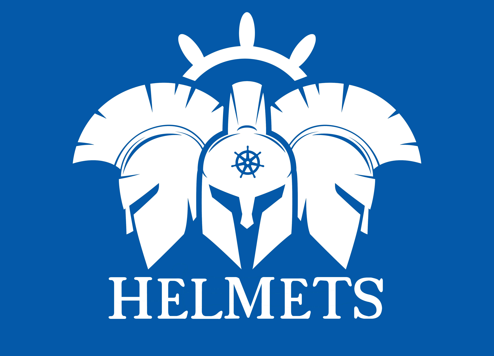

# Helmets

### A lightweight visualizer for Kubernetes Helm charts.

Helmets provides a means of tracking shared values across multiple charts.

 

## Documentation and Installation

> To download the app, you can find it under "Releases" on the right-hand side of GitHub!

 

## Key Features

> Upload your Kubernetes Helm chart folder
>  
> Select a sub-chart from the dropdown menu
>  
> Select a value from the React Flow area
>  
> Helmets provides a path to track the shared values

 

## Questions and Support

> If you have any questions or need help with the project, please don't hesitate to ask! You can <a href="https://github.com/oslabs-beta/helmets/issues">create an issue</a> on this repo

 

## Contributing

Please check out [Contributing](CONTRIBUTING.md) for more information on how to contribute to Helmets.

 

## The Team

|   Developed By   |                                                                                                                                                |                                                                                                                                                                   |
| :--------------: | :--------------------------------------------------------------------------------------------------------------------------------------------: | :---------------------------------------------------------------------------------------------------------------------------------------------------------------: |
|  Dom Chaloeisak  |       |                      |
|    Megan Choi    |      |                             |
|   Ryan Griggs    |     |               |
|  Lane Hamilton   |     |                     |
| Cameron McKinley |  |  |

 

Give a ⭐️ if this project helped you!

 

## Tech Stack

 

[![JavaScript][JavaScript]][JavaScript-url] [![React][React.js]][React-url]   [![HTML5][HTML5]][HTML5-url] [![SASS][SASS]][SASS-url] 

 

## License

Distributed under the MIT License. See [LICENSE](LICENSE) for more information.

 

[React.js]: https://img.shields.io/badge/react-%2320232a.svg?style=for-the-badge&logo=react&logoColor=%2361DAFB
[React-url]: https://reactjs.org/
[JavaScript]: https://img.shields.io/badge/javascript-%23323330.svg?style=for-the-badge&logo=javascript&logoColor=%23F7DF1E
[JavaScript-url]: https://www.javascript.com/
[HTML5]: https://img.shields.io/badge/html5-%23E34F26.svg?style=for-the-badge&logo=html5&logoColor=white
[HTML5-url]: https://developer.mozilla.org/en-US/docs/Web/HTML/
[SASS]: https://img.shields.io/badge/SASS-hotpink.svg?style=for-the-badge&logo=SASS&logoColor=white
[SASS-url]: https://sass-lang.com/
